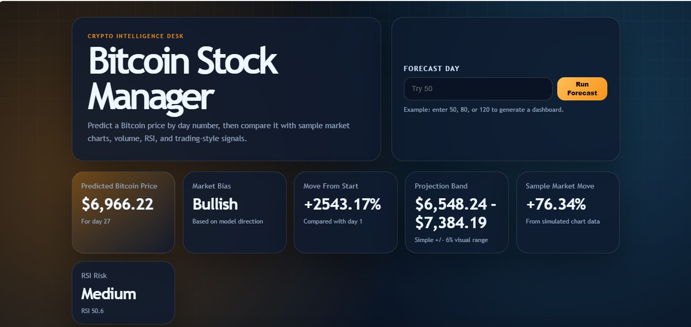
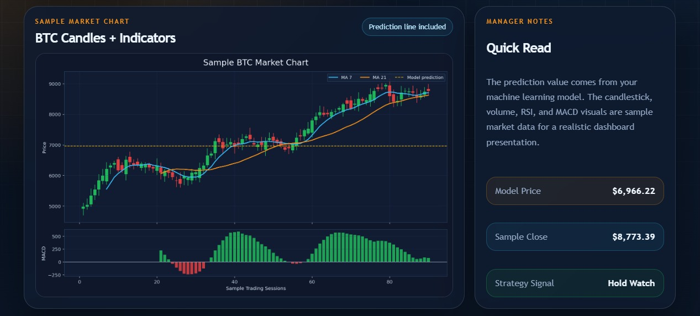
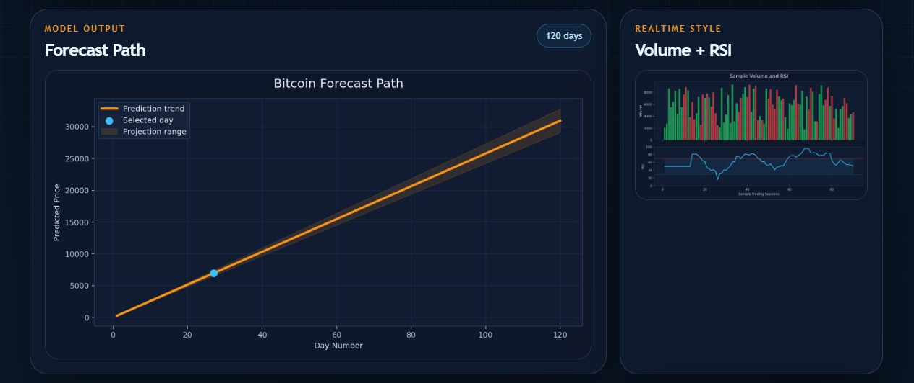

<h1 align="center">🚀 AI Bitcoin Price Predictor</h1>

<p align="center">
  <b>Crypto Intelligence Dashboard with ML-based Forecasting & Market Insights 📊</b>
</p>

<p align="center">
  
  
  
  
</p>

---

## 🌟 Overview

AI-powered system to **predict Bitcoin price trends** using Machine Learning and visualize insights through an **interactive dashboard**.

It combines:
- 📈 Price prediction models  
- 📊 Market indicators (RSI, Volume, Trends)  
- 📉 Forecast visualization  

---

## 🖥️ Main Dashboard

<p align="center">
  
</p>

---

## 📊 Dashboard Preview

### 🔹 Market Analysis (Candles + Indicators)
<p align="center">
  
</p>

### 🔹 Forecast & RSI Insights
<p align="center">
  
</p>

---

## 🔥 Key Features

✨ Clean & Interactive UI Dashboard  
📊 Exploratory Data Analysis (EDA)  
⚙️ Feature Engineering  
📈 Bitcoin Price Prediction  
📉 RSI & Volume Analysis  
📊 Forecast Visualization with Projection Bands  
📌 Trading-style Signals (Bullish / Hold / Watch)

---

## 🧠 Machine Learning Models

- Linear Regression  
- Logistic Regression  
- (Extendable to advanced models)

---

## 🛠️ Tech Stack

- 🐍 Python  
- 📊 Pandas, NumPy  
- 📉 Matplotlib  
- 🤖 Scikit-learn  
- 🌐 Flask (for UI integration)

---

## ⚙️ Workflow

```text
Data Collection → Data Cleaning → EDA → Feature Engineering → Model Training → Prediction → Visualization

📈 Key Insight

Bitcoin prices are highly volatile, and prediction accuracy depends heavily on:
- Feature selection
- Data preprocessing
- Market conditions

🔮 Future Improvements

🚀 LSTM / Deep Learning models
🌐 Real-time crypto API integration
🧠 Sentiment Analysis (News + Twitter)
📊 Advanced Technical Indicators

📂 Project Structure
```text
├── app.py
├── ai_model.py
├── dataset.csv
├── templates/
├── static/
├── README.md

🚀 How to Run
```text
git clone https://github.com/your-username/Bitcoin-Price-Prediction.git
cd Bitcoin-Price-Prediction
pip install -r requirements.txt
python app.py

Open in browser:
```text
http://127.0.0.1:5000/

👨‍💻 Author
Harsh Shah
📍 Engineering Student | Data & ML Enthusiast
